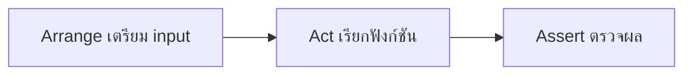

# แพลน: Unit Test สำหรับ `calculateTotal` (มือใหม่)

## Unit Testing คืออะไร (สั้น ๆ)

**Unit Test** = ทดสอบฟังก์ชันหนึ่งตัวแบบแยกเดี่ยว ๆ ไม่ต้องเปิดเว็บ ไม่ต้องพึ่ง database

ในโปรเจกต์นี้ใช้ **Vitest** เป็นเครื่องมือรันเทสต์ (คล้าย Jest)

| คำ                               | ความหมาย                            |
| -------------------------------- | ----------------------------------- |
| `describe`                       | กล่องรวมเทสต์ของฟังก์ชันเดียวกัน    |
| `test`                           | เคสหนึ่งแถวในตาราง                  |
| `expect(...).toBe(...)`          | ตรวจว่าค่าที่ได้ตรงกับที่คาด        |
| `expect(() => ...).toThrow(...)` | ตรวจว่าฟังก์ชันโยน Error ตามข้อความ |

**AAA Pattern** ที่โจทย์ให้ใช้ในทุกเทสต์:

1. **Arrange** — เตรียมค่า input (`price`, `quantity`)
2. **Act** — เรียก `calculateTotal(...)`
3. **Assert** — ตรวจผลด้วย `expect`



---

## ฟังก์ชันที่ต้องทดสอบ (อย่าแก้ไฟล์นี้)

ดูที่ [`src/utils/calculateTotal.js`](src/utils/calculateTotal.js):

- ราคาติดลบ → โยน Error `"ราคาต้องไม่ติดลบ"`
- `quantity > 0` → คืน `price * quantity`
- นอกนั้น (quantity เป็น 0 หรือติดลบ) → คืน `0`

---

## ขั้นตอนที่ทำจริง

### 1) Setup โปรเจกต์ (ถ้ายังไม่ทำ)

```bash
npm install
npx vitest run
```

รันแล้วจะเห็นเทสต์ตัวอย่างผ่านจาก [`tests/unit/calculateDiscount.test.js`](tests/unit/calculateDiscount.test.js) — ใช้ไฟล์นี้เป็นต้นแบบโครงสร้าง

### 2) สร้างไฟล์เทสต์ใหม่

สร้าง [`tests/unit/calculateTotal.test.js`](tests/unit/calculateTotal.test.js)

โครงแบบที่โจทย์กำหนด:

```javascript
import { describe, test, expect } from "vitest";
import { calculateTotal } from "../../src/utils/calculateTotal.js";

describe("calculateTotal", () => {
  // เขียน test() ตามตารางทีละแถว
});
```

### 3) เขียน `test()` ทั้ง 6 เคสตามตาราง (AAA)

| ประเภท     | สิ่งที่เทสต์ | Input     | Expected                   |
| ---------- | ------------ | --------- | -------------------------- |
| Happy Path | quantity > 1 | `100, 3`  | `300`                      |
| Boundary   | quantity = 1 | `100, 1`  | `100`                      |
| Boundary   | price = 0    | `0, 5`    | `0`                        |
| Error Case | quantity = 0 | `100, 0`  | `0`                        |
| Error Case | quantity < 0 | `100, -2` | `0`                        |
| Error Case | price ติดลบ  | `-10, 2`  | throw `"ราคาต้องไม่ติดลบ"` |

ตัวอย่างเคสตัวเลข (AAA):

```javascript
test("คำนวณราคารวมถูกต้องเมื่อ quantity > 1", () => {
  // Arrange
  const price = 100;
  const quantity = 3;

  // Act
  const result = calculateTotal(price, quantity);

  // Assert
  expect(result).toBe(300);
});
```

ตัวอย่างเคส Error (ต้องห่อด้วยฟังก์ชันก่อนเรียก `toThrow`):

```javascript
test("โยน Error เมื่อราคาติดลบ", () => {
  expect(() => calculateTotal(-10, 2)).toThrow("ราคาต้องไม่ติดลบ");
});
```

ข้อสำคัญ: **ห้ามแก้** logic ใน `src/utils/calculateTotal.js` — เขียนเฉพาะไฟล์เทสต์

### 4) รันเช็กผล

```bash
npx vitest run
```

หรือรันเฉพาะไฟล์นี้:

```bash
npx vitest run tests/unit/calculateTotal.test.js
```

เป้าคือเทสต์ทั้ง 6 เคสผ่าน (สีเขียว)

---

## สิ่งที่จะได้หลังทำจบ

- ไฟล์ใหม่ 1 ไฟล์: `tests/unit/calculateTotal.test.js`
- ไม่แก้โค้ด production
- เข้าใจวงจร Arrange → Act → Assert และความต่างของ Happy / Boundary / Error case
